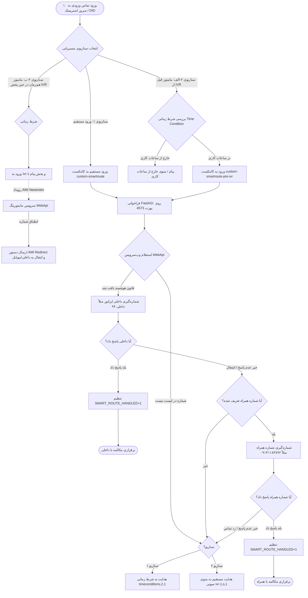

# راهنمای جامع راه‌اندازی و اتصال مسیریابی هوشمند تماس (Smart Call Routing)

این سند مراحل کامل، قطعی و یکپارچه تنظیمات سرور تماس استریسک (Asterisk / FreePBX / Issabel)، سرویس FastAGI، وب‌سرویس WebApi و داشبورد مدیریتی را برای هدایت هوشمند تماس‌های ورودی تشریح می‌کند.

---

## ۱. فلوچارت تصمیم‌گیری و سناریوهای مسیریابی (Decision Flowchart)



---

## ۲. دیاگرام توالی رویدادها (Sequence Diagram)

```mermaid
sequenceDiagram
    autonumber
    actor Caller as تماس‌گیرنده (موبایل)
    participant PBX as سرور Asterisk (DID: 9429001492)
    participant FastAGI as سرویس FastAGI (Port 4573)
    participant WebApi as وب‌سرویس Ntk.Asterisk.WebApi (Port 5310)
    participant Dash as داشبورد مدیریت و SignalR (Port 5314)
    actor Ext as داخلی اپراتور (داخلی ۹۴)
    actor Mobile as همراه اپراتور (۰۹۱۳...)
    participant IVR as منوی صوتی (ivr-1)

    Caller->>PBX: تماس ورودی به خط
    PBX->>FastAGI: فراخوانی FastAGI (agi://h.ntk.ir:4573/smartroute)
    FastAGI->>WebApi: استعلام قوانین مسیر (POST /api/v1/CallRoutes/Lookup)
    WebApi->>Dash: ارسال لحظه‌ای رویداد تصمیم‌گیری (SignalR smartRouteDecision)
    WebApi-->>FastAGI: نتیجه انطباق: داخلی ۹۴ (۱۵ ثانیه) + فوروارد ۰۹۱۳۱۱۸۳۸۹۲
    
    rect rgb(30, 41, 59)
        note right of FastAGI: مرحله اول: شماره‌گیری داخلی اپراتور
        FastAGI->>PBX: ارسال دستور Dial(Local/94@from-internal,15)
        alt حالت ۱: داخلی پاسخ می‌دهد
            Ext-->>PBX: پاسخ (Answer)
            FastAGI->>PBX: تنظیم متغیر SMART_ROUTE_HANDLED=1
            PBX-->>Caller: برقراری مکالمه با داخلی
            FastAGI->>WebApi: ثبت وضعیت: Answered on Ext 94
        else حالت ۲: داخلی پاسخ نمی‌دهد (Timeout / Busy)
            note right of FastAGI: مرحله دوم: شماره‌گیری شماره همراه
            FastAGI->>PBX: ارسال دستور Dial(Local/09131183892@from-internal,30)
            alt همراه پاسخ می‌دهد
                Mobile-->>PBX: پاسخ (Answer)
                FastAGI->>PBX: تنظیم متغیر SMART_ROUTE_HANDLED=1
                PBX-->>Caller: برقراری مکالمه با شماره همراه
                FastAGI->>WebApi: ثبت وضعیت: Answered on Mobile
            else حالت ۳: همراه نیز پاسخ نمی‌دهد
                note right of FastAGI: مرحله سوم: بازگشت به روال عادی سیستم
                FastAGI-->>PBX: پایان اسکریپت AGI
                PBX->>IVR: هدایت به شرط زمانی یا منوی صوتی ivr-1
                IVR-->>Caller: پخش پیام صوتی منوی اصلی
                FastAGI->>WebApi: ثبت وضعیت: Fallback to Normal Flow
            end
        end
    end
```



---

## ۳. جدول پورت‌ها و الزامات فایروال

| پورت | پروتکل | جهت ترافیک | شرح عملکرد |
| :--- | :--- | :--- | :--- |
| **`4573`** | **TCP** | **استریسک ➔ سیستم میزبان FastAGI** | **پورت اصلی FastAGI:** ارسال درخواست‌های استعلام مسیر از استریسک به ویندوز |
| **`4572`** | **TCP** | **استریسک ➔ سیستم میزبان FastAGI** | **پورت ثانویه FastAGI:** مانیتورینگ رزرو پکت‌ها |
| **`5038`** | **TCP** | **سیستم میزبان WebApi ➔ استریسک** | **پورت AMI:** مانیتورینگ زنده، لاگ رویدادها و دستورات هدایت کانال (Redirect) |
| **`5310`** | **HTTP** | **ارتباط داخلی ویندوز** | وب‌سرویس REST برای استعلام قوانین و ثبت تصمیمات |
| **`5314`** | **HTTP** | **مرورگر کاربر ➔ پنل مدیریت** | داشبورد مانیتورینگ زنده و تعریف قوانین مسیردهی |

---

## ۴. تنظیمات روی کامپیوتر ویندوز (میزبان FastAGI و WebApi)

### ۱) باز کردن پورت‌های ۴۵۷۳ و ۴۵۷۲ در فایروال ویندوز:
در **PowerShell (Run as Administrator)** دستور زیر را اجرا کنید:

```powershell
New-NetFirewallRule -DisplayName "Asterisk FastAGI Primary" -Direction Inbound -LocalPort 4573 -Protocol TCP -Action Allow
New-NetFirewallRule -DisplayName "Asterisk FastAGI Secondary" -Direction Inbound -LocalPort 4572 -Protocol TCP -Action Allow
```

### ۲) تنظیم Port Forwarding در روتر/مودم (در صورت اتصال از اینترنت `h.ntk.ir`):
- **External Port:** `4573` (TCP)
- **Internal IP:** `192.168.0.210` (آی‌پی سیستم ویندوز شما)
- **Internal Port:** `4573` (TCP)

### ۳) بررسی شنود پورت‌ها در ویندوز:
```powershell
netstat -ano | findstr /R "4573 4572"
```
خروجی باید نشان‌دهنده وضعیت `LISTENING` روی هر دو پورت باشد.

---

## ۵. تنظیمات روی سرور استریسک (Asterisk / FreePBX / Issabel)

### الف) تنظیم دیال‌پلن در `/etc/asterisk/extensions_custom.conf`

فایل زیر را در سرور لینوکس باز کنید:
```bash
nano /etc/asterisk/extensions_custom.conf
```

کانتکست‌های زیر را در انتهای فایل قرار دهید:

```asterisk
; =========================================================================
; Ntk.Asterisk Smart Call Routing Contexts (karavi)
; =========================================================================

; -------------------------------------------------------------------------
; سناریوی ۱: ورود مستقیم از خط ورودی (Inbound Route) به سیستم هوشمند
; -------------------------------------------------------------------------
[custom-smartroute]
exten => s,1,NoOp(=== [Smart Route Direct] Checking Caller: ${CALLERID(num)} on DID: ${FROM_DID} ===)
 same => n,Set(SMART_ROUTE_HANDLED=0)
 same => n,AGI(agi://h.ntk.ir:4573/smartroute)
 same => n,GotoIf($["${SMART_ROUTE_HANDLED}" = "1"]?done)
 same => n,NoOp(--- Smart Route: Fallback to Normal Time Conditions ---)
 same => n,Goto(timeconditions,2,1)
 same => n(done),Hangup()

; -------------------------------------------------------------------------
; سناریوی ۲-الف: ارزیابی در ورودی IVR (بعد از شرط زمانی و قبل از پخش پیام منوی صوتی)
; -------------------------------------------------------------------------
[custom-smartroute-pre-ivr]
exten => s,1,NoOp(=== [Smart Route Pre-IVR] Checking Caller: ${CALLERID(num)} ===)
 same => n,Set(SMART_ROUTE_HANDLED=0)
 same => n,AGI(agi://h.ntk.ir:4573/smartroute)
 same => n,GotoIf($["${SMART_ROUTE_HANDLED}" = "1"]?done)
 same => n,NoOp(--- Non-VIP Caller: Forwarding to IVR-1 Menu ---)
 same => n,Goto(ivr-1,s,1)
 same => n(done),Hangup()
```

ذخیره فایل و اعمال در استریسک:
```bash
asterisk -rx 'dialplan reload'
```

---

### ب) تنظیمات سناریوی ۲-ب: مانیتورینگ هم‌زمان در حین پخش IVR با لایه AMI (Live In-IVR AMI Intercept)

در این رویکرد:
1. تماس مستقیماً وارد منوی صوتی `ivr-1` شده و پیام صوتی شروع به پخش می‌کند.
2. ماژول مانیتورینگ AMI در وب‌سرویس (`Ntk.Asterisk.WebApi`) رویداد ورود کانال به `ivr-1` را دریافت می‌کند.
3. وب‌سرویس شماره تماس‌گیرنده را با پایگاه‌داده مسیرها تطبیق می‌دهد:
   - **در صورت انطباق:** دستور `RedirectAction` از طریق پورت ۵۰۳۸ به استریسک ارسال شده و همان کانال فعال را از IVR خارج کرده و به داخلی یا شماره همراه هدایت می‌کند.
   - **در صورت عدم انطباق:** هیچ دستوری ارسال نشده و تماس‌گیرنده بدون وقفه کلیدهای منوی صوتی را شماره‌گیری می‌کند.

---

### ج) تنظیم در محیط وب Issabel / FreePBX

#### ۱. ایجاد Custom Destination:
1. در منوی وب به مسیر **PBX ➔ PBX Configuration ➔ Custom Destinations** بروید.
2. دکمه **Add Custom Destination** را بزنید:
   - **Custom Destination:** `custom-smartroute,s,1` (برای سناریو ۱) یا `custom-smartroute-pre-ivr,s,1` (برای سناریو ۲-الف)
   - **Description:** `Smart Call Routing`
3. دکمه **Submit Changes** را بزنید.

#### ۲. تنظیم مقصد تماس ورودی:
- **برای سناریوی ۱ (ورود مستقیم):**
  - به مسیر **PBX ➔ Inbound Routes** بروید و خط ورودی مورد نظر (`9429001492`) را باز کنید.
  - بخش **Set Destination** را روی **Custom Destinations ➔ Smart Call Routing** قرار دهید.
- **برای سناریوی ۲ (در ورودی IVR):**
  - به مسیر **PBX ➔ Time Conditions** بروید و شرط زمانی شماره ۲ را باز کنید.
  - بخش **Destination if time matches** را روی **Custom Destinations ➔ Smart Call Routing** قرار دهید.
- دکمه **Submit** و سپس دکمه قرمز رنگ **Apply Config** را بزنید.

---

## ۶. دستورات عیب‌یابی و تست ارتباط

### ۱) تست اتصال پورت از استریسک به ویندوز:
```bash
curl -v --connect-timeout 3 telnet://h.ntk.ir:4573
```
خروجی موفق:
```text
* Connected to h.ntk.ir (95.38.10.25) port 4573 (#0)
```

### ۲) بررسی کانتکست‌های بارگذاری‌شده در استریسک:
```bash
asterisk -rx 'dialplan show custom-smartroute'
asterisk -rx 'dialplan show custom-smartroute-pre-ivr'
```

### ۳) مشاهده لاگ زنده FastAGI هنگام تماس:
```bash
asterisk -rvvv
agi set debug on
```

---

## ۷. داشبورد و مانیتورینگ زنده

در مرورگر به آدرس زیر بروید:
```text
http://localhost:5314/dashboard
```

در بخش **ورود تماس‌ها و تصمیم‌گیری مسیر هوشمند (Smart Call Routing)**:
- وضعیت پورت‌های شنود (۴۵۷۳ و ۴۵۷۲) به صورت سبز (`Listening`) نمایش داده می‌شود.
- به محض برقراری تماس، بسته دریافتی، شماره تماس‌گیرنده، داخلی مقصد، شماره همراه انتقال و وضعیت پاسخ‌گویی به صورت بلادرنگ و بدون نیاز به رفرش صفحه قابل مشاهده است.
